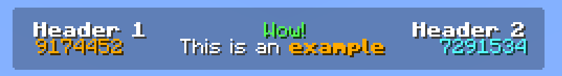

# Font UI
*A simple library for positioning text in minecraft*

### Installation
This library is intended for use on Minecraft Paper plugins on version 26.1.2 and onwards, though it may work further back. To use this package, you're going to need to add `jitpack` to your build system repositories:

If you're using gradle, put this repository into your `build.gradle.kts`
```kotlin
repositories {
    mavenCentral()
    maven("https://jitpack.io")
}
```

Or if you're using maven, enter this into your `pom.xml`
```xml
<repositories>
    <repository>
        <id>jitpack.io</id>
        <url>https://jitpack.io</url>
    </repository>
</repositories>
```

Once you have the repository set up, you can add the `f-UI` dependency in your build system

If you use gradle:
```kotlin
dependencies {
    implementation("com.github.29cmb:f-UI:VERSION")
}
```

Or if you use maven:
```xml
<dependency>
    <groupId>com.github.29cmb</groupId>
    <artifactId>f-UI</artifactId>
    <version>VERSION</version>
</dependency>
```

### Usage

The usage of this project comes in 3 parts, the resource pack, the configure, and the draw.

In order to use most of the features of this library, you'll need to have a basic understanding on negative spacing and font glyphs in Minecraft resource packs.

Once you have a resource pack setup, you can configure a `FontUI` instance using the `buildFontUI` function.

You *can* construct multiple of these and use them differently throughout your project, though likely you'll only need one singleton across the entire codebase.

```kotlin
class FuiExample : JavaPlugin() {
    lateinit var fontUI: FontUI
    
    override fun onEnable() {
        // All files of this resource pack can be found in the `example/src/main/resources` directory
        
        // You need to provide a copy of your resource pack that the library can access
        // The best place to put this is in your plugins data folder
        fontUI = buildFontUI(File(this.dataFolder, "pack.zip")) {
            // Enable if you want A LOT of logging
            // debug = true

            // Registers a single font
            // This will search through all the bitmap fonts with a single character and calculate their width and height
            // At this time, full font atlasses are not supported, only single character bitmaps
            registerFont(NamespacedKey("example", "glyphs"))
            
            // Registers default ascent fonts
            // These are copies of the vanilla font but with an additional provided ascent value
            // Then, the font key is determined by this lambda call, with the ascent value passed in
            registerDefaultAscents(-4, 4, -8, 8, -12, 12, -16, 16, -20, 20, -24, 24, -28, 28, -32, 32, -36, 36, -40, 40, 44, -44, 48, -48) {
                NamespacedKey("example", "default_offset_$it")
            }
            
            // Registers spacing characters
            // For this library to work properly, every combination of integers must be possible in both positive and negative.
            // The best way to do this is with spaces that shift by a power of 2
            // Decimal values are possible and can help with positioning, but be wary of floating point inaccuracies
            registerSpacingCharacters(buildMap {
                put('\uE000', 0.5)
                for (i in 1..11) {
                    put('\uE000' + i, (1 shl (i - 1)).toDouble())
                }

                put('\uF000', -0.5)
                for (i in 1..11) {
                    put('\uF000' + i, -(1 shl (i - 1)).toDouble())
                }
            }, NamespacedKey("example", "spaces"))
        }
    }
}
```

Once you've built your font UI instance, you can call its `draw` method to render text

```kotlin
// 120 is the total width that aligned objects pivot around
// You can overflow this when actually rendering text, but aligned glyphs will be relative to this
fontUI.draw(120) { ctx ->
    // In this space, you have access to a few methods for rendering text
    // This renders using a cursor X and Y. X is determined by spacing, and Y by ascent fonts
    // Each of these methods moves the X cursor in some way or another, usually to the end of the text its rendered
    
    // Draws the background glyph at the center of the view with no shadow
    ctx.drawAligned(mm("<font:example:glyphs>\uF001</font>").shadowColor(ShadowColor.shadowColor(0)), TextDrawContext.Alignment.CENTER)
    
    // Draws some text centered at the default Y height
    ctx.drawAligned(mm("<white>This is an <gold><b>example</b></gold>"), TextDrawContext.Alignment.CENTER)
    
    // Moves the cursor up to render text directly above the previous centered text
    // Lower ascents means higher text
    ctx.moveCursor(ctx.cursorX, -8)
    ctx.drawAligned(mm("<green>Wow!</green>"), TextDrawContext.Alignment.CENTER)

    // Moves the cursor to the left and up to display a left aligned header
    // This acts as normal text, moving the cursor forward
    ctx.moveCursor(-60, -8)
    ctx.draw(mm("<white><b>Header 1</b></white>"), TextDrawContext.Alignment.LEFT)
    
    // Moves the cursor back down to render a left aligned number 
    ctx.moveCursor(-60, 0)
    ctx.draw(mm("<gold>9174452</gold>"), TextDrawContext.Alignment.LEFT)

    // Does the same thing on the other side, but this time right aligned
    // This text keeps the cursor in the same place but moves the text back
    ctx.moveCursor(172, -8)
    ctx.draw(mm("<white><b>Header 2</b></white>"), TextDrawContext.Alignment.RIGHT)
    ctx.moveCursor(172, 0)
    ctx.draw(mm("<aqua>7291534</aqua>"), TextDrawContext.Alignment.RIGHT)
}
```

This call simply results in a component, so it can immediately be sent to a player


### Special Thanks

[lucyydotp](https://github.com/lucyydotp) for making the original [tinsel library](https://github.com/lucyydotp/tinsel) that this one is based off of (most of the math is reused from there, truly a lifesaver)

[Septicuss](https://github.com/septicuss) for [this amazing guide on resource pack fonts](https://septicuss.notion.site/Fonts-ce8c8c12c313463ea01ac9b16d7e6bbb) that helped me better understand negative spacing